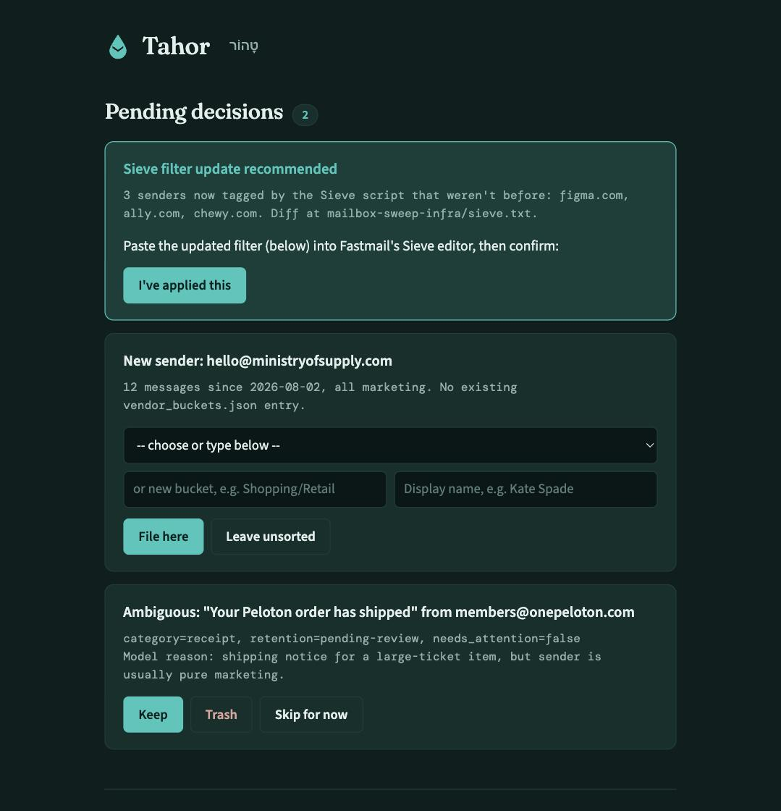
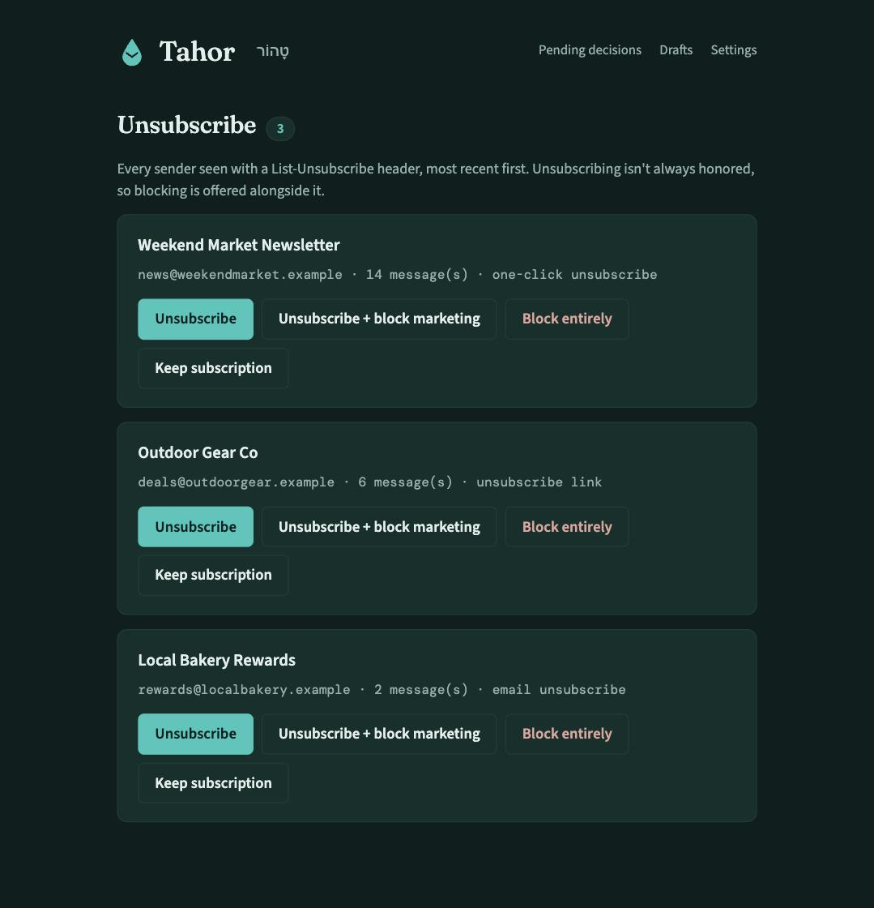

# Tahor

Tahor (Hebrew טָהוֹר, "clean, pure") is a headless mailbox-triage pipeline.
An LLM classifies each message, tags it with real IMAP keywords, and
separate sweeps delete or file mail based on that tag. For the cases the
classifier can't call confidently, an optional small web app lets a human
resolve them asynchronously instead of blocking the pipeline. Everything
here is standard-library-only Python except the web app, which needs
Flask and requests.

<p align="center">
  
  
</p>
<p align="center"><sub>The decision app's pending-decisions and unsubscribe pages, shown with example data.</sub></p>

## Architecture

- **Always running (pick one):** `backlog_worker.py`, an unattended loop
  under systemd that fetches, classifies, tags, and repeats -- or run
  `fetch_batch.py` / `classify.py` / `process_batch.py` / `keyword_tool.py`
  by hand or from cron, one stage at a time.
- **Sweeps (scheduled, separate from classification):** `retention_sweep.py`
  deletes mail whose retention window has passed and that's been read;
  `filing_sweep.py` moves receipts and statements into per-vendor folders
  once they've had a fair chance to be seen.
- **Decision app (optional):** `decision-app/app.py`, a small Flask site
  for resolving ambiguous cases -- new vendor mappings, free-text rules,
  unsubscribe candidates, drafted replies -- from a browser instead of a
  live session.
- **Reply drafting (optional):** `draft_replies.py` watches for mail from
  senders you've configured as reply triggers (settings page) and drafts
  a reply for each -- saved into your Drafts folder as a real in-thread
  reply, never sent automatically.

## Requirements

- Python 3.9+.
- An IMAP account with app-password support. This was built against
  Fastmail; any IMAP host works.
- An OpenAI-compatible chat endpoint: a local model server (LM Studio,
  Ollama) or a hosted API key (Gemini, OpenRouter, or anything else that
  speaks the same protocol).

## Running this for $0/month

Every choice below is a default, not a requirement -- swap in whatever
compute and models you already have. But if you're starting from nothing,
this whole pipeline runs for free:

- **Compute:** Oracle Cloud's Always Free tier includes an Ampere A1
  instance (4 OCPUs, 24 GB RAM, permanently free, no trial period) --
  comfortably enough for this workload. `backlog_worker.py` idles at a few
  MB of memory between batches.
- **Classification:** OpenRouter's free-tier models (`CLASSIFY_BACKEND=
  openrouter-free` in `classify.py`) cost nothing, capped at roughly
  1,000 requests/day account-wide. For a typical inbox that's plenty once
  the initial backlog is cleared -- new mail trickles in far slower than
  1,000 messages/day for most people.
- **Rule drafting:** Gemini's free tier (`gemini-flash` in the settings
  page) costs nothing and this runs rarely anyway -- a few times a month
  at most.

The only place real money enters is optional and deliberate: switching
`CLASSIFY_BACKEND` to `openrouter` (paid) or picking a paid model for rule
drafting or reply drafting, when you want to clear a large backlog faster
than the free tier's daily cap allows. At current OpenRouter pricing
that's on the order of $0.0003 per email -- clearing 50,000 backlogged
messages costs roughly $15, once, not an ongoing cost. See
`classify.py`'s docstring for the full backend list and tradeoffs.

## Quick start

```
git clone <this repo>
cd tahor
./install.sh
```

Then:

1. Edit `.env` with your IMAP host, address, and app password.
2. Edit `vendor_buckets.json` and `prompt.txt` for your own mail (see
   "Your own data" below for what each file is and how to track them in
   your own private repo).
3. Pick a `CLASSIFY_BACKEND` (see `classify.py`'s docstring for the
   tradeoffs between local/gemini/openrouter/openrouter-free).
4. Run a batch by hand before automating anything, so you can see what
   it actually does to a real mailbox:
   ```
   python3 fetch_batch.py INBOX current_batch
   python3 classify.py current_batch_in.json current_batch_out.json prompt.txt
   python3 process_batch.py current_batch INBOX
   python3 keyword_tool.py current_batch_ops.json
   ```
5. Once that looks right, set up ongoing operation. Either the always-on
   worker:
   ```
   sudo cp tahor-backlog-worker.service.example /etc/systemd/system/tahor-backlog-worker.service
   sudo systemctl daemon-reload
   sudo systemctl enable --now tahor-backlog-worker
   ```
   or cron, running each stage on its own schedule:
   ```
   */30 * * * * cd /path/to/tahor && python3 fetch_batch.py INBOX current_batch && python3 classify.py current_batch_in.json current_batch_out.json prompt.txt && python3 process_batch.py current_batch INBOX && python3 keyword_tool.py current_batch_ops.json
   0 4 * * * cd /path/to/tahor && python3 retention_sweep.py
   0 5 * * * cd /path/to/tahor && python3 filing_sweep.py
   */30 * * * * cd /path/to/tahor && python3 draft_replies.py
   ```

## The decision app

Some cases aren't clear-cut: a sender you haven't mapped to a folder yet,
or a rule you want to state in your own words rather than as JSON. The
decision app queues those up on a page instead of blocking the pipeline,
and `apply_decisions.py` picks up what you resolved on the next run.

It has no built-in auth beyond Google OAuth restricted to one address, so
set that up first:

1. In the Google Cloud Console, create an OAuth client ID (Web
   application). Set the authorized redirect URI to
   `<BASE_URL>/auth/google/callback` -- for a local-only setup that's
   `http://localhost:8420/auth/google/callback`.
2. Set `GOOGLE_CLIENT_ID`, `GOOGLE_CLIENT_SECRET`, `BASE_URL`, and
   `ALLOWED_EMAIL` (the one address allowed to sign in) in `.env`.
3. Run it: `python3 decision-app/app.py`.

It binds to `127.0.0.1` only. Don't expose it to the internet without
putting TLS in front of it yourself -- nginx with certbot, Caddy, or a
tunnel. An unauthenticated decision queue on the open internet is a bad
idea regardless of the OAuth check.

### Unsubscribing and blocking senders

Any sender whose mail carries a `List-Unsubscribe` header shows up on the
`/unsubscribe` page. Four choices per sender: unsubscribe only, unsubscribe
and block that sender's marketing mail going forward (transactional mail --
receipts, shipping notices -- still comes through), block everything from
that sender outright, or leave the subscription alone. A one-click
(RFC 8058) unsubscribe fires as a real HTTP request; anything else is a
best-effort attempt (a plain link click or an unsubscribe email) with no
guarantee it's honored, which is exactly why blocking exists alongside it.

### Reply drafting

Add a trigger on the settings page -- a specific address or a whole
domain -- and matching mail gets a drafted reply from whichever model
you've picked for rule drafting. The draft lands in your Drafts folder as
a real in-thread reply (`In-Reply-To`/`References` set, so it threads
correctly) and is never sent on its own; it also shows up on `/drafts` for
a second look. Each run that produces at least one draft sends you a
one-line summary email so a new draft is never silently missed.

## Your own data

Four files hold everything specific to your mailbox, and all four are
gitignored -- nothing you put in them can end up in this repo's history,
even by accident:

- **`.env`** -- your IMAP host, address, app password, API keys, and every
  other secret. Copied from `.env.example` by `install.sh`.
- **`vendor_buckets.json`** -- a flat map of sender label to
  `[folder, display name]`, read by `filing_sweep.py` and updated by the
  decision app's vendor-mapping flow. Starts from `vendor_buckets.example.json`.
- **`prompt.txt`** -- the system prompt the classifier reads. Starts from
  `prompt.example.txt`, which is a complete, working prompt on its own --
  edit it to match how you actually want your mail judged, don't just add
  to it forever.
- **`sieve.txt`** -- the Sieve filter `generate_sieve.py` writes and
  `propose_sieve_update.py` proposes (via the decision app's dismissable
  banner) whenever your sender-block list changes. Starts from
  `sieve.example.txt`. Sieve can't be pushed to Fastmail via API, so this
  is always something you paste in yourself.

The three data files (not `.env`) all live under one `DATA_DIR`, which
defaults to this repo's own root. If you want your real vendor mappings,
prompt, and Sieve rules to have their own version history -- reasonable,
since they'll accumulate small edits over months -- point `DATA_DIR` at a
**separate, private git repository** instead:

```
git init ~/tahor-data
cp vendor_buckets.example.json prompt.example.txt sieve.example.txt ~/tahor-data/
cd ~/tahor-data && git mv vendor_buckets.example.json vendor_buckets.json && \
  git mv prompt.example.txt prompt.txt && git mv sieve.example.txt sieve.txt && \
  git add -A && git commit -m "start data repo"
```

Then set `DATA_DIR=/home/you/tahor-data` (or wherever) in `.env` and in
the decision app's environment. Nothing about the code changes -- it's
one environment variable, read by `apply_decisions.py` and
`propose_sieve_update.py`. This is exactly the pattern used to build and
run the live instance this project came out of.

## Deploying on Oracle Cloud's Always Free tier

An Always Free Ampere A1 instance runs this comfortably -- it's a small,
low-traffic workload. The A1 shape is ARM, so if you add any dependency
beyond Flask and requests, check it ships an ARM wheel or is pure Python;
both of Tahor's own dependencies already do.

Nothing here is actually Oracle-specific. A Raspberry Pi, a $5 VPS, or a
Fly.io machine works the same way -- Oracle is just where this happened to
get built.

## Why these design choices

Retention and filing are separate decisions. A message can be tagged for
standard retention and still sit in the inbox indefinitely -- filing out
of the inbox is reserved for categories with no read-now value at all
(receipts, statements, tax mail). Keeping them separate means a filing
mistake never risks a deletion, and a retention tier never determines
where something ends up living.

Retention has four tiers: transient (days -- OTPs, duplicate alerts),
standard (years -- the default for ordinary keeps), forever (used
sparingly -- legal documents, durable-goods receipts), and
pending-review (genuinely ambiguous, left alone rather than guessed at).

Nothing unread is ever deleted, regardless of age or tier. Filing itself
waits out a grace period too, rather than moving something out of the
inbox before there's been a real chance to see it.

## License

MIT — see LICENSE.

### Worker recovery

The continuous worker reads the speed setting each batch: paid for fast
processing, free for no-cost processing, or auto for a balanced split.
In paid or auto mode, failed paid classifications retry on the free tier.
Credit errors or widespread paid failures start a five-minute cooldown,
then a single-message paid probe checks for recovery at the next batch.
A successful probe restores the configured mode without changing settings.
Free-only mode never sends paid requests.

When neither tier can process mail, the worker waits five minutes before
retrying. Failed messages remain pending. OpenRouter may reject even free
requests when the account balance is negative; see its
[credit limits documentation](https://openrouter.ai/docs/api_reference/limits).

Recovery tests run without network or mailbox access:
`python3 -m unittest discover -s tests -v`.
