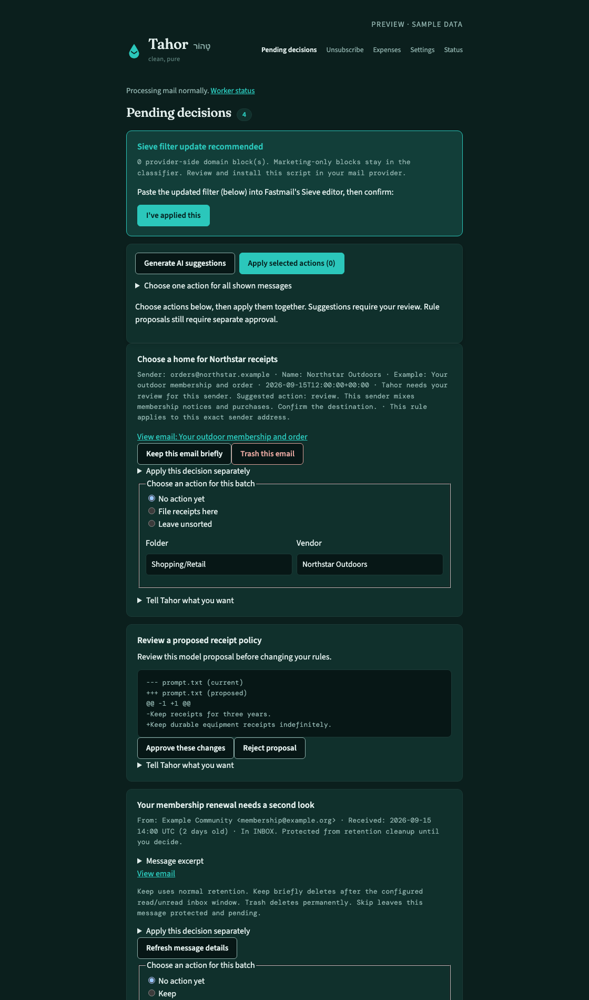
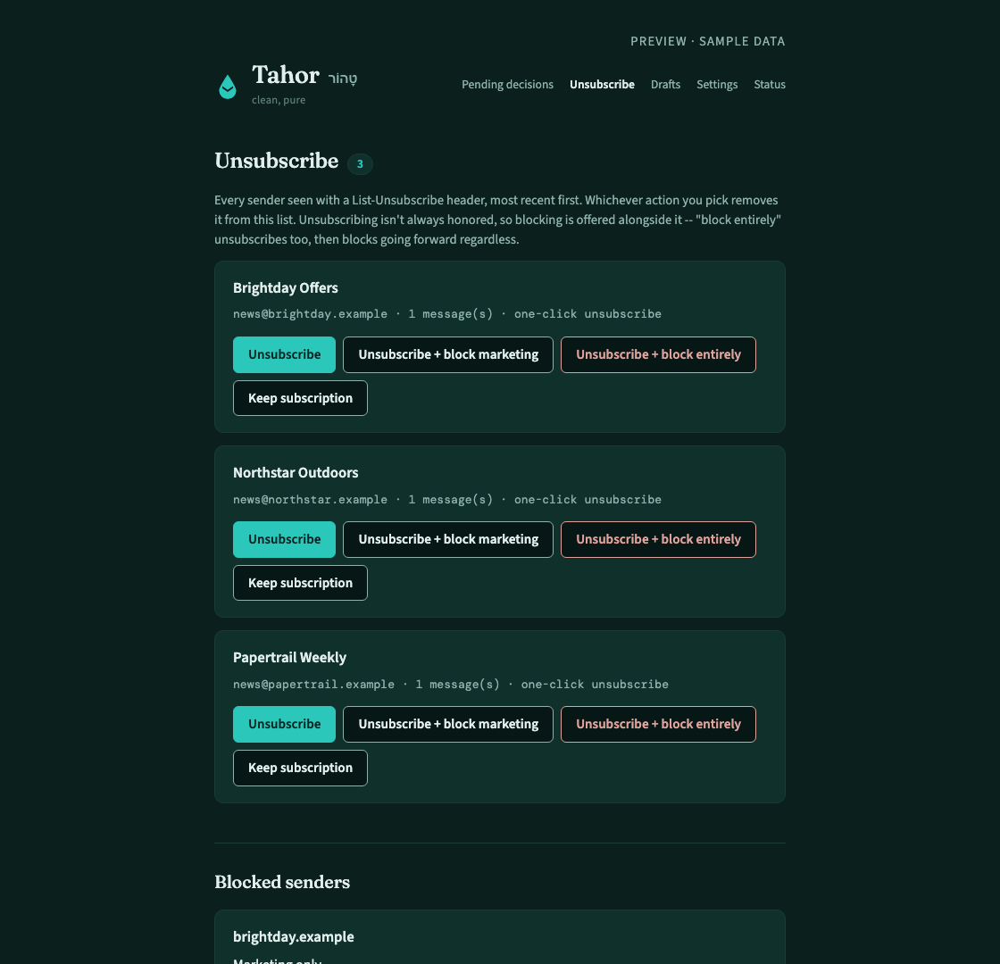
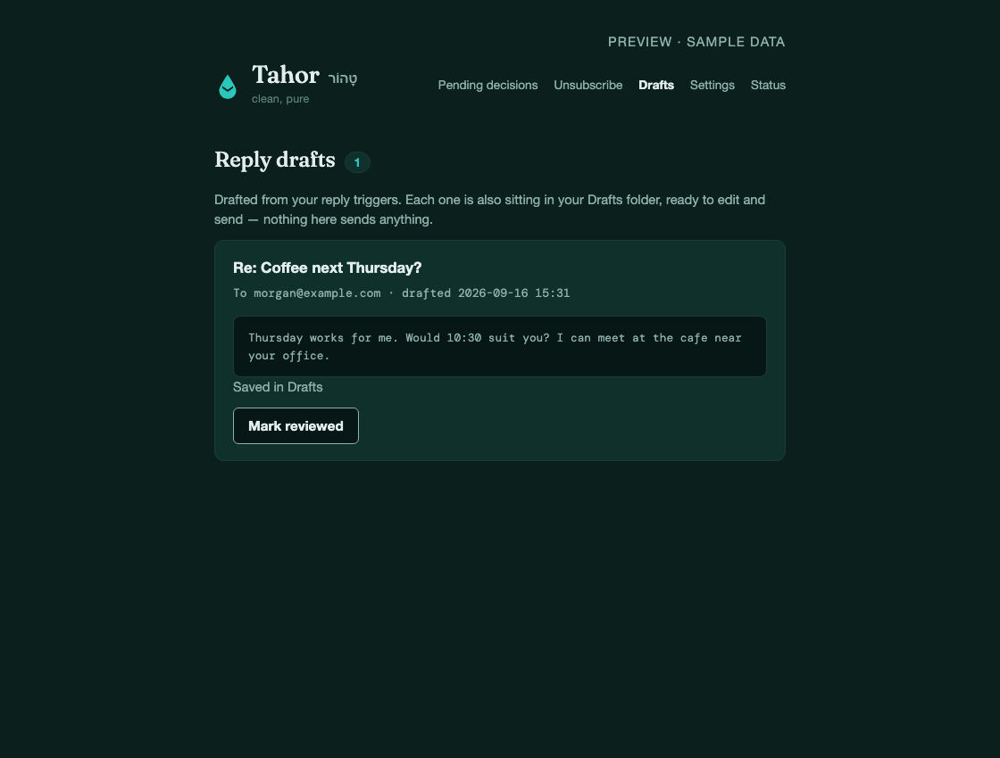
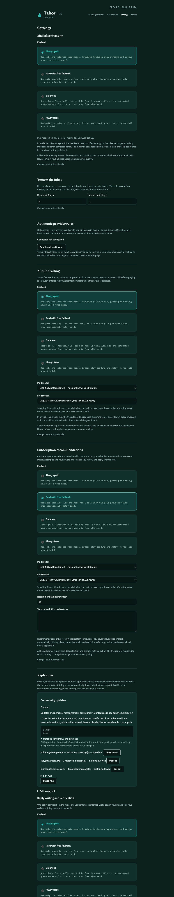
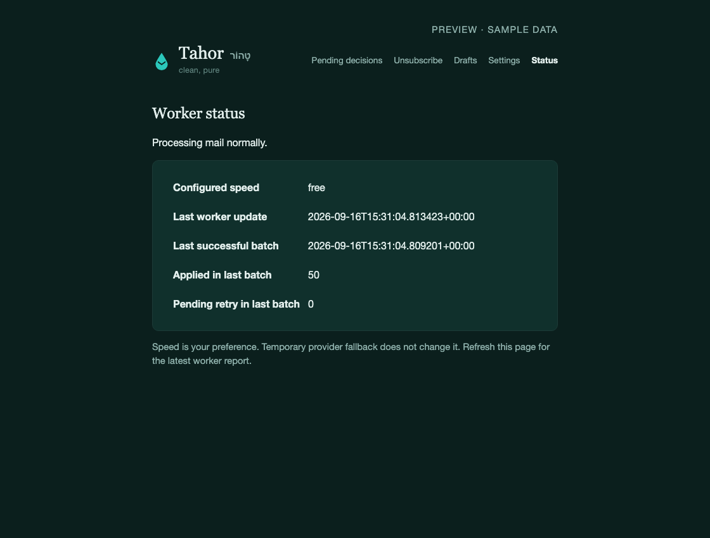
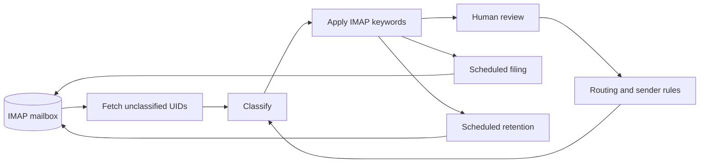

<p align="center">
  
</p>

<p align="center">
  <a href="#get-started">Get started</a> ·
  <a href="#inside-the-app">See the app</a> ·
  <a href="#how-it-works">Architecture</a> ·
  <a href="docs/setup.md">Setup guide</a> ·
  <a href="docs/operations.md">Operations</a>
</p>

<p align="center">
  <a href="LICENSE"></a>
  
  
</p>

**Tahor is a self-hosted email assistant that works inside your existing mailbox.**
It classifies the backlog, tags messages, files receipts, helps you unsubscribe,
and prepares replies for review. Your usual email client stays your email client.

The name comes from **טָהוֹר**, Hebrew for “clean, pure.” The aim is practical:
less inbox maintenance, fewer lost receipts, and a clear place to review decisions
that should not be left to a model.

| The routine work | Your control |
| :--- | :--- |
| Classify and tag messages in the background | Review ambiguous mail before retention cleanup |
| Route receipts and statements to useful folders | Choose the vendor’s destination in the app |
| Track unsubscribe requests and sender blocks | Keep subscriptions, block marketing, or block a domain |
| Draft a response when a chosen sender writes | Edit and send it yourself from your mail client |
| Recover from provider failures | See actual worker progress and retry status |

## Inside the app

<p align="center">
  
</p>
<p align="center"><sub>The decision queue keeps unresolved choices visible. Screenshots use synthetic data.</sub></p>

<table>
<tr>
<td width="50%"><br><strong>Subscriptions, with an exit.</strong><br>Request an unsubscribe, keep transactional mail, and remove a block later.</td>
<td width="50%"><br><strong>A first draft, never an automatic send.</strong><br>Replies are saved in the mailbox’s Drafts folder with their thread headers.</td>
</tr>
</table>

The app also includes separate model settings for classification, rule drafting,
and reply drafting, plus a Status page showing the last successful batch.
[Try the sample-data preview](#try-it-without-connecting-a-mailbox).

<details>
<summary>See model controls and live worker status</summary>

| Choose the speed and models | See whether work is progressing |
| :---: | :---: |
|  |  |

</details>

## Get started

You need **Python 3.9+**, an IMAP mailbox with an app password, and an
[OpenRouter API key](https://openrouter.ai/keys). Fastmail is the reference
provider. Other providers need IMAP keywords; filing requires `MOVE`, and
retention requires `UIDPLUS`. The setup check reports these capabilities.

```bash
git clone https://github.com/nulluid/tahor.git
cd tahor
./install.sh
```

The installer creates a virtual environment, asks for credentials without
echoing them, and writes private configuration outside the checkout. New setups
use **free models for all three tasks**. Rerunning setup preserves your existing
configuration, prompt, and routing rules.

Check the connection, then start processing:

```bash
venv/bin/python run.py doctor --check-imap --check-model
venv/bin/python run.py worker
```

The check uses a read-only mailbox connection and a synthetic model request.
The worker applies classification tags. Filing and deletion run separately;
they are not started by this command.

**For the complete setup:** [web login, unattended services, safe sweep previews,
and HTTPS](docs/setup.md). Google OAuth and your mailbox/provider credentials
must be configured by you; the installer does not create those accounts.

### Try it without connecting a mailbox

```bash
python3 -m venv venv
venv/bin/python -m pip install -r requirements.txt
venv/bin/python demo.py
```

Open **http://127.0.0.1:8421**. This runs the real UI with disposable sample data.
It cannot send mail, change a mailbox, or make model requests. No account or API
key is needed.

## Choose the pace

| Mode | Behavior | Inference cost |
| :--- | :--- | :--- |
| **Free** | Uses the free classification backend and retries when unavailable | No paid classification requests |
| **Paid** | Uses paid capacity to work through a large backlog faster | Provider usage charges |
| **Auto** | Estimates a free/paid split from backlog size and observed free throughput | Variable paid usage |

In Paid or Auto mode, failed paid classifications retry on the free tier.
Widespread failures start a five-minute cooldown, followed by a single-message
paid recovery probe at the next batch. If both tiers fail, messages stay pending
and the worker retries after five minutes. Your selected speed does not change.

### A setup without an added inference bill

Keep classification in **Free**, and select the free model for **both rule and
reply drafting**. The installer makes these choices by default. Run Tahor on an
existing computer or a server you already have.

This does not make your email account, hardware, electricity, or hosting free.
Free model capacity and account quotas are provider-controlled. OpenRouter can
also reject free requests when an account balance is negative.
[Provider limits](https://openrouter.ai/docs/api_reference/limits) ·
[Free model variants](https://openrouter.ai/docs/guides/routing/model-variants/free)

## How it works



The worker searches for unclassified UIDs instead of repeatedly downloading the
whole inbox. A message is recorded as processed only after its IMAP keyword
write succeeds. Failed writes and classifications remain eligible for retry.
Messages without a Message-ID use a local identity derived from the mailbox and
UID. Before applying saved UID operations, Tahor checks the mailbox’s UIDVALIDITY
value so a reset cannot redirect an old operation to a different message.

**Classification, filing, and deletion are separate operations.** This makes it
possible to inspect tags and preview sweeps before enabling mailbox changes.
The pipeline uses Python’s standard library; the optional web app adds Flask,
requests, and Gunicorn. SQLite holds review decisions and draft state. No broker,
external database, or frontend build is required.

| Component | Responsibility |
| :--- | :--- |
| `backlog_worker.py` | Fetch, classify, recover from backend failures, and apply tags |
| `process_batch.py` / `keyword_tool.py` | Enforce sender rules and track confirmed mailbox writes |
| `filing_sweep.py` | Move aged receipts, statements, and tax mail with IMAP `MOVE` |
| `retention_sweep.py` | Delete only eligible read messages using targeted UID expunge |
| `decision-app/` | Review decisions, apply rules, manage subscriptions and model settings |
| `draft_replies.py` | Prepare recoverable, thread-aware drafts for configured senders |
| `runtime_status.py` | Share worker progress with the app and health-check command |
| `setup_tahor.py` / `run.py` | Configure a private instance and launch each component consistently |

### Engineering choices

| Decision | Reason |
| :--- | :--- |
| Mailbox keywords are the processing checkpoint | A failed write leaves the message eligible for retry, even if a local audit file says it was seen |
| Persist a draft before appending it to IMAP | A retry reuses the prepared text and checks its stable Message-ID before saving again |
| Lock settings updates and replace files atomically | Concurrent web and worker updates preserve each other’s fields |
| Separate public code, private rules, and runtime state | Instances can share a release without sharing credentials or mailbox data |

These behaviors have [regression tests](tests). The tradeoff is a deliberately
small deployment: one mailbox owner and one host, with SQLite and local file locks.

## Boundaries that matter

- **Unread mail is excluded from retention deletion.** Forever, pending-review,
  and needs-attention messages are protected as well. Filing can move unread
  messages after its longer grace period; moving and deleting are distinct.
- **Reply drafts are never sent automatically.** A stable draft Message-ID lets
  retries recover an interrupted save without intentionally appending another copy.
- **Uncertain mail stays reviewable.** Ambiguous classifications receive a
  pending-review retention tag and a decision in the app.
- **Failures stay visible.** A failed rule can be retried; a failed unsubscribe is
  not silently marked successful. A saved block still applies if unsubscribing fails.
- **Sieve changes are proposals.** The generator preserves custom rules outside
  its managed section. You review and install the resulting script at your provider.
- **Hosted models receive mail content.** Classification sends sender, subject,
  date, and a short body excerpt. Reply drafting sends a longer excerpt. Rule
  drafting sends the instruction and current routing/prompt configuration.

Retention defaults are seven days for transient mail and three years for standard
mail. The reference sweeper excludes Trash, Spam, Sent, Drafts, and Archive.
Review [configuration and operating limits](docs/operations.md) before enabling it.

## Your data stays separate

```text
~/.config/tahor/
├── config.env          # credentials and instance settings; mode 0600
├── data/
│   ├── prompt.txt
│   ├── vendor_buckets.json
│   └── sieve.txt
└── state/
    ├── decisions.db
    ├── settings.json
    └── worker_status.json
```

The public repository contains reusable code, tests, example configuration, and
sample-data screenshots. Real prompts, vendor mappings, and Sieve rules can live
in a separate **private** repository through `DATA_DIR`. Data commits stay local
unless you explicitly enable pushing. Credentials, message batches, databases,
and logs do not belong in either repository. Gitignore rules help; review staged
changes before publishing.

[Private data and backups](docs/operations.md#private-data-and-backups)

## Development and verification

```bash
venv/bin/python -m pip install -r requirements-dev.txt
venv/bin/python -m unittest discover -s tests -v
```

Tests exercise behavior across provider recovery, confirmed IMAP writes, retention
safety, concurrent settings updates, web actions, OAuth/CSRF checks, Sieve syntax,
reply-draft recovery, and repeatable setup. They use disposable state and fake
network boundaries, without connecting to a real mailbox.

The sample preview and screenshots are reproducible:

```bash
venv/bin/python demo.py --export /tmp/tahor-preview
venv/bin/python scripts/capture_screenshots.py --chrome /path/to/chrome
```

[Contributing](CONTRIBUTING.md) · [Security](SECURITY.md) ·
[Setup](docs/setup.md) · [Operations](docs/operations.md)

---

MIT licensed. Built to make a mailbox easier to live with.
