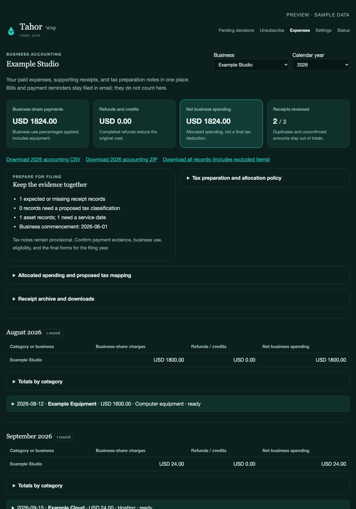
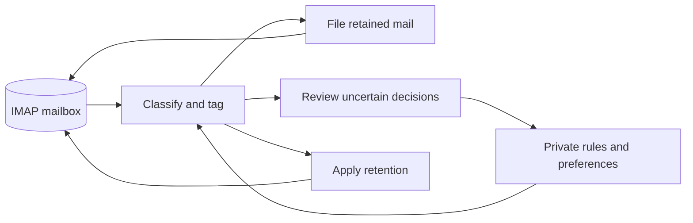

<p align="center">
  
</p>

<p align="center">
  <a href="#get-started">Get started</a> ·
  <a href="#inside-the-app">See the app</a> ·
  <a href="#how-it-works">Architecture</a> ·
  <a href="docs/setup.md">Setup guide</a> ·
  <a href="docs/operations.md">Operations</a>
</p>

<p align="center">
  <a href="LICENSE"></a>
  
  
</p>

**Tahor is a self-hosted email assistant for your existing mailbox.** It sorts
incoming mail, works through your backlog, preserves useful records, helps you
stop unwanted marketing, and prepares replies for you to review. Keep using the
email client you already like.

The name comes from **טָהוֹר**, Hebrew for “clean, pure.” The goal is a calmer
inbox without giving up control of your mail.

| Let Tahor handle | Stay in control of |
| :--- | :--- |
| Classification, filing, and retention | Which messages need attention and how long mail stays in your inbox |
| Unsubscribe requests and marketing blocks | Keeping receipts and other transactional mail |
| Reply drafting | Your instructions, signature, and every message you send |
| Business receipt organization | Separate businesses, expense allocations, and accounting exports |
| Retries and background processing | Progress, model costs, and optional health alerts |

## Inside the app

<p align="center">
  
</p>
<p align="center"><sub>Review suggestions, preview an email, and apply decisions without losing your place. All screenshots use fictional sample data.</sub></p>

<table>
<tr>
<td width="50%"><br><strong>Less marketing, useful mail preserved.</strong><br>Review a batch of recommendations and stop marketing while keeping transactions.</td>
<td width="50%"><br><strong>Replies in your own mailbox.</strong><br>Describe the replies you want, then review the drafts in your usual email client.</td>
</tr>
</table>

<details>
<summary>See the accounting dashboard</summary>



</details>

<details>
<summary>See Settings and worker status</summary>

| Model settings and inbox timing | Processing progress |
| :---: | :---: |
|  |  |

</details>

## Get started

You need **Python 3.9+**, an IMAP mailbox with an app password, and an
[OpenRouter API key](https://openrouter.ai/keys). Fastmail is the reference
provider. Other providers need IMAP keywords; filing requires `MOVE`, and
retention requires `UIDPLUS`. Tahor checks these capabilities during setup.

```bash
git clone https://github.com/nulluid/tahor.git
cd tahor
./install.sh --mode paid_only
```

The installer creates a virtual environment, prompts for credentials without
echoing them, and stores private configuration outside the checkout. Running it
again preserves your existing configuration and rules.

Check your connection, then start the worker:

```bash
venv/bin/python run.py doctor --check-imap --check-model
venv/bin/python run.py worker
```

The check uses a read-only mailbox connection and a synthetic model request.
**The worker changes your mailbox:** it applies classification tags and deletes
messages classified as trash. Filing and age-based retention run as separate
scheduled jobs, which you can preview before enabling.

The command above selects paid classification. Omitting `--mode paid_only`
selects always-free classification for a new installation. **The free model has
known classification errors, including treating important mail as trash.** Review
the disclosures in Settings before enabling it. AI rule and reply writing remain
disabled until you select their models.

For the complete installation, follow the **[setup guide](docs/setup.md)** to
configure web login, HTTPS, and unattended services. Web login uses Google OAuth;
you configure that account and your mailbox credentials. Use the
[dedicated service-account setup](docs/service-isolation.md) on an internet-facing
server so Tahor runs without administrator privileges.

### Try it without connecting a mailbox

After cloning the repository:

```bash
python3 -m venv venv
venv/bin/python -m pip install -r requirements.txt
venv/bin/python demo.py
```

Open **http://127.0.0.1:8421**. The preview runs the real UI with disposable sample
data. It needs no account or API key and cannot change a mailbox or call a model.

## Everyday use

**Review the exceptions.** Tahor automatically files confident matches and brings
uncertain cases to Pending decisions. Read an email in the preview, accept a
suggested folder, or give written instructions. AI suggestions cover 20 decisions
per batch by default; change the limit in Settings. Recommendations appear first,
and the action bar stays visible while you scroll.

**Keep receipts separate from correspondence.** A sender’s filing area has
Receipts and Correspondence folders. Shared delivery services are matched by the
actual sender, so one marketplace purchase does not define every future purchase.
Business receipt rules can use calendar-year folders.

**Stop marketing without losing transactions.** On Subscriptions, select
**Stop marketing, keep transactions**, unsubscribe only, keep the subscription,
or block all mail. Ask AI to recommend a batch of up to 50 senders by default,
review the choices, and apply them together. Past decisions and your written
guidance inform later suggestions. Some senders require confirmation on their
website; email-based unsubscribe requests require SMTP sending access.

**Describe the replies you want.** In Settings → Reply rules, choose a sender,
domain, or natural-language condition, then add writing instructions and a
signature. Exclude individual senders from a rule when needed. Tahor saves a
threaded reply in Drafts and leaves the original unread. It checks the proposed
reply against your instructions, but you still review and send it yourself.
**Tahor never sends these replies automatically.** Creating a draft does not
extend the original message’s inbox window.

**Understand the decision buttons.** Keep releases a review hold while preserving
normal filing and retention rules. Keep briefly uses the configured three-day
read or seven-day unread window, measured from delivery. Trash deletes the
message. Skip for now leaves it protected. Decide later keeps a filing request
pending; dismissing it stops repeat requests for that sender without creating a rule.

[Detailed operating guide](docs/operations.md)

## Business receipts and accounting

Keep each business’s records separate, with receipt folders such as
`Your Business/Receipts/YYYY`. Matching receipts receive permanent retention.
The Expenses dashboard opens to your default business and the current year;
use the selectors to switch businesses or years.

Review compact receipt rows, add purpose notes, and split a charge across
bookkeeping accounts. Monthly and yearly summaries apply business-use percentages
and allocations, with refunds reducing net spending. Bills, payment reminders,
financing principal, and excluded entries do not count as expenses. Expected
purchases and missing receipts stay in a separate checklist.

Equipment records retain cost basis, purchase and service dates, and proposed
depreciation or amortization treatment. Private filing notes and allocation
policies stay with the business. **These are tax-preparation records, not a
calculated tax return:** Tahor does not finalize deductions or file taxes.

Download an accounting CSV or a ZIP with original emails, review history,
allocation lines, asset records, and filing notes. Accounting downloads exclude
items awaiting review and possible duplicates. Removing an entry preserves its
filed email; a separately labeled full-records download retains excluded records
for recovery. A manifest identifies any original emails still awaiting archive.

AI can propose the vendor, date, amount, currency, category, and business-purpose
comment. Suggestions do not overwrite confirmed values. Configure private
business rules and future-entry policies using the
[business filing and accounting guide](docs/business-ledger.md).

## Models and costs

Choose a model and spending policy independently for classification, reply
writing, rule writing, Pending decisions, and subscription recommendations.
Expense suggestions use the rule-writing configuration. Settings save as you
change them.

| Policy | Behavior |
| :--- | :--- |
| **Always paid** | Retry paid failures without switching to free |
| **Paid with free fallback** | Use free while paid is failing; periodically check paid recovery |
| **Free with paid escalation** | Use paid temporarily if the estimated free queue exceeds four hours or free is unavailable |
| **Always free** | Retry free failures without making paid requests |

To avoid an inference bill, choose Always free for every enabled task and run
Tahor on an existing computer. Your email account, electricity, and any rented
hosting remain separate costs. Free capacity and quotas depend on the provider.

Free models can misclassify mail, recommend an unsuitable rule, or invent details
in a draft. Paid models can also make mistakes. Review model disclosures and
suggested actions; replies remain drafts and AI-written rules require approval.
See [model configuration and limits](docs/operations.md) for supported choices.

## Mailbox behavior and privacy

- **Inbox time is configurable.** Folder moves wait three days for read mail and
  seven days for unread mail by default. Classification happens immediately.
- **Trash does not wait.** Mail classified as trash is deleted immediately. Other
  mail expires under its retention policy whether read or unread. Permanent,
  pending-review, and needs-attention tags protect it from retention cleanup.
- **Unread remains useful.** Eligible low-attention mail is marked read after
  filing. Attention flags, review holds, and starred messages remain protected.
- **The inbox comes first.** Tahor processes new mail and the backlog without a
  folder-size ceiling. Trash waits until the inbox is caught up.
- **Failures stay visible and retryable.** Unconfirmed mailbox operations remain
  pending, and optional health alerts identify problems needing intervention.
- **Hosted models receive message content.** Classification, drafting, and expense
  suggestions send the context needed for their task. Supported routes enforce
  zero-data-retention and denied-data-collection settings; this does not make
  remote inference equivalent to keeping all content on your own machine.

Default retention is seven days for transient mail and three years for standard
mail. The reference retention sweep excludes Trash, Spam, Sent, Drafts, and
Archive. Review [retention settings](docs/operations.md) before enabling cleanup.

Optional [health alerts and daily summaries](docs/notifications.md) arrive in your
inbox over IMAP. Summaries link back to Tahor and expire after your configured
read/unread window; no SMTP permission is needed to receive them.

For Fastmail, you can install generated Sieve rules yourself or enable the
[isolated credential connector](docs/fastmail-connector.md) to manage supported
whole-domain blocks. It uses an unpublished provider interface and requires
explicit enrollment with account-login authority. Keep this separate from the
ordinary IMAP app password.

## How it works



Tahor uses Python workers, a Flask web app, and SQLite. It needs no external
database, message broker, or frontend build. The deployment is designed for one
mailbox owner on one host; accounting profiles separate that owner’s businesses.

| Reliability boundary | What it protects |
| :--- | :--- |
| Confirmed IMAP keyword writes are processing checkpoints | Failed writes remain eligible for retry |
| Mailbox generation and message identity checks precede saved operations | Stale UIDs cannot silently target another message |
| Prepared drafts and stable message IDs survive retries | Interrupted saves can be recovered |
| Locked, atomic settings updates | Web and background workers preserve each other’s changes |
| Separate code, private configuration, and runtime state | Releases do not contain an instance’s mailbox or credentials |

[Operations and deployment](docs/operations.md) ·
[Service isolation](docs/service-isolation.md) · [Security](SECURITY.md)

## Your data and recovery

Configuration and runtime data live outside the public checkout under
`~/.config/tahor/` by default. The public repository contains reusable code,
tests, example configuration, and fictional screenshots—not real mailbox data,
private business identities, credentials, or personal rules.

Private snapshots preserve rules, preferences, drafts, decisions, accounting
profiles, and archived receipt originals. A separate trusted computer can pull
and verify recovery copies over SSH. Connector login credentials and session
tokens are excluded from those recovery bundles and require separate enrollment.

[Set up backups and recovery](docs/private-backups.md)

## Development

```bash
venv/bin/python -m pip install -r requirements-dev.txt
venv/bin/python -m unittest discover -s tests -v
```

Tests use disposable state and simulated network boundaries, without connecting
to a real mailbox. They cover recovery, IMAP identity checks, retention, web
security, settings updates, accounting, and repeatable installation.

Reproduce the preview and screenshots:

```bash
venv/bin/python demo.py --export /tmp/tahor-preview
venv/bin/python scripts/capture_screenshots.py --chrome /path/to/chrome
```

[Contributing](CONTRIBUTING.md) · [Setup guide](docs/setup.md) ·
[Operations](docs/operations.md) · [Security](SECURITY.md)

---

MIT licensed. Built to make a mailbox easier to live with.
