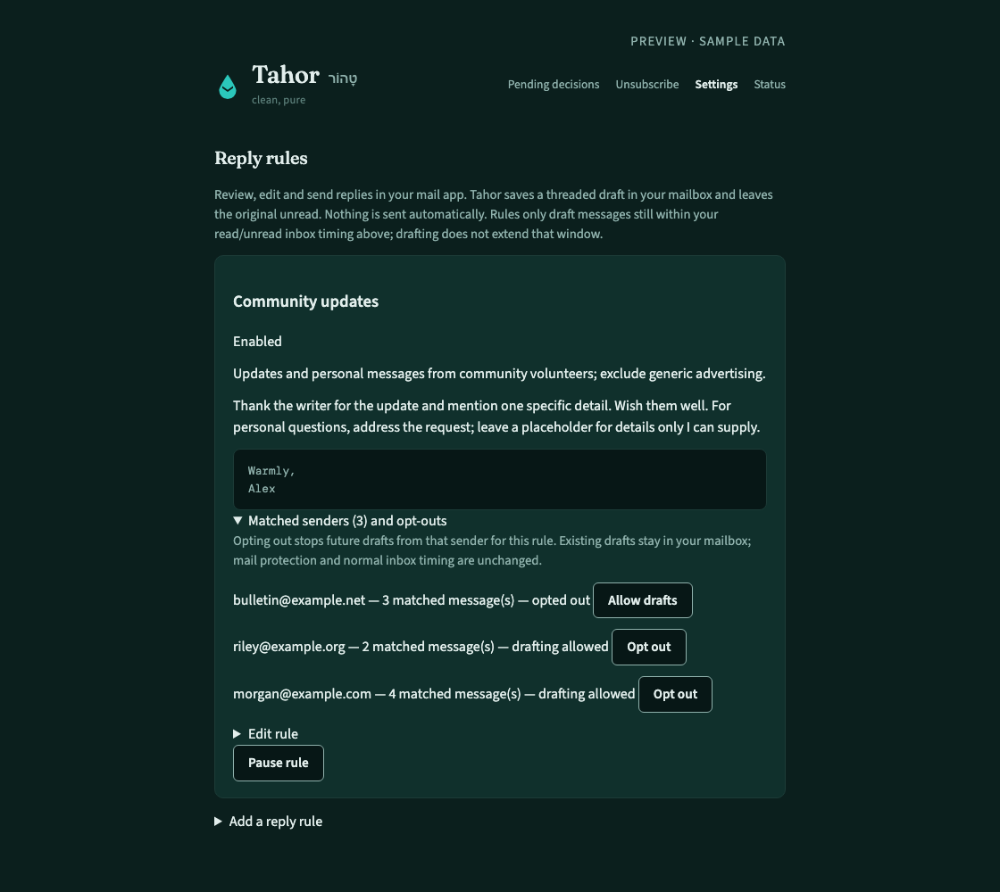
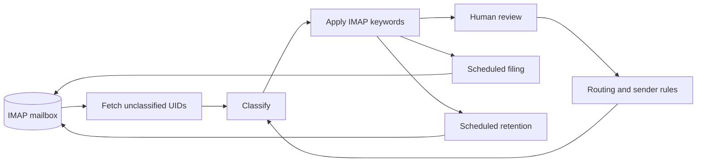

<p align="center">
  
</p>

<p align="center">
  <a href="#get-started">Get started</a> ·
  <a href="#inside-the-app">See the app</a> ·
  <a href="#how-it-works">Architecture</a> ·
  <a href="docs/setup.md">Setup guide</a> ·
  <a href="docs/operations.md">Operations</a>
</p>

<p align="center">
  <a href="LICENSE"></a>
  
  
</p>

**Tahor is a self-hosted email assistant that works inside your existing mailbox.**
It classifies the backlog across every folder without a folder-size limit, tags
messages, files receipts, helps you unsubscribe,
and prepares replies for review. Your usual email client stays your email client.

The name comes from **טָהוֹר**, Hebrew for “clean, pure.” The aim is practical:
less inbox maintenance, fewer lost receipts, and a clear place to review decisions
that should not be left to a model.

| The routine work | Your control |
| :--- | :--- |
| Classify and tag messages in the background | Review ambiguous mail before retention cleanup |
| File routine receipts and statements, then mark them read | Choose the vendor’s destination in the app |
| Track unsubscribe requests and sender blocks | Keep subscriptions, block marketing, or block a domain |
| Draft a response when your reply rule matches | Find the original unread; edit and send its draft in your mail client |
| Recover from provider failures | See actual worker progress and retry status |
| Place optional health alerts and daily summaries in your inbox | Choose which notifications to enable and your digest time |

## Inside the app

<p align="center">
  
</p>
<p align="center"><sub>The decision queue keeps unresolved choices visible. Screenshots use synthetic data.</sub></p>

<table>
<tr>
<td width="50%"><br><strong>Subscriptions, with an exit.</strong><br>Request an unsubscribe, keep transactional mail, and remove a block later.</td>
<td width="50%"><br><strong>Your instructions, your mailbox.</strong><br>Describe which messages deserve a reply and how it should read. Review the draft in your usual email client.</td>
</tr>
</table>

The app also includes separate model settings for classification, rule drafting,
and reply drafting, plus a Status page showing the last successful batch.
[Try the sample-data preview](#try-it-without-connecting-a-mailbox).

<details>
<summary>See model controls and live worker status</summary>

| Choose models and inbox timing | See whether work is progressing |
| :---: | :---: |
|  |  |

</details>

## Get started

You need **Python 3.9+**, an IMAP mailbox with an app password, and an
[OpenRouter API key](https://openrouter.ai/keys). Fastmail is the reference
provider. Other providers need IMAP keywords; filing requires `MOVE`, and
retention requires `UIDPLUS`. The setup check reports these capabilities.

```bash
git clone https://github.com/nulluid/tahor.git
cd tahor
./install.sh --mode paid_only
```

The installer creates a virtual environment, asks for credentials without
echoing them, and writes private configuration outside the checkout. New setups
leave AI rule and reply writing **disabled until you select a model in Settings**. Rerunning setup preserves your existing
configuration, prompt, and routing rules.

This command explicitly selects always-paid classification. Without `--mode paid_only`,
a new installation uses always-free classification. Read the free-model limitations
below before processing your mailbox; free mode never silently incurs paid charges.

Check the connection, then start processing:

```bash
venv/bin/python run.py doctor --check-imap --check-model
venv/bin/python run.py worker
```

The check uses a read-only mailbox connection and a synthetic model request.
The worker applies classification tags and deletes messages classified as trash.
Folder filing and age-based retention cleanup run as separate scheduled jobs.

**For the complete setup:** [web login, unattended services, safe sweep previews,
and HTTPS](docs/setup.md). Google OAuth and your mailbox/provider credentials
must be configured by you; the installer does not create those accounts.

### Try it without connecting a mailbox

```bash
python3 -m venv venv
venv/bin/python -m pip install -r requirements.txt
venv/bin/python demo.py
```

Open **http://127.0.0.1:8421**. This runs the real UI with disposable sample data.
It cannot send mail, change a mailbox, or make model requests. No account or API
key is needed.

## Replies where you already read mail

Describe a rule in **Settings → Reply rules**: which messages should match, what
the reply should say, a signature, and a limit of one to three body sentences.
Use natural language or match a specific sender or domain. For example, ask for
brief acknowledgments of community project updates that mention a specific
milestone, while answering personal questions according to their actual content.
Expand the rule’s matched-sender list to opt individual senders out.

Tahor saves a threaded reply in your mailbox’s **Drafts** folder and leaves the
original unread. A separate check with your selected writing model reviews the
reply against the source and your instructions; a rejected reply is revised once
and checked again. Rejected text is not added to Drafts. Model checks can still
miss mistakes; review every reply before sending. Personal questions
that need your answer also receive an attention flag. Edit and send it in your
usual email client; there is no separate
web draft editor and **Tahor never sends these replies automatically**. Choose a
separate spending policy for reply writing in Settings. Writer and verifier use
the same model for each attempt. Provider failures retry after a five-minute
cooldown, using another tier only when your policy permits it. Quality checks
can leave a draft pending even when a model is available.
**Ling 3.0 Flash VL** is the free writing option, restricted to Novita with zero
data retention, data collection denied, and zero input/output pricing. It can
invent promises or details; review every draft. These
[routing controls](https://openrouter.ai/docs/guides/features/zdr) protect provider
selection; they do not guarantee the accuracy of a draft.
All rule and reply writing requests require zero data retention and denied data
collection. Retired Nemotron free and unverified direct Gemini writing routes are
disabled; missing or obsolete selections never silently switch to a paid model. A reply
address must pass syntax and DNS checks. Those checks cannot prove that the
recipient’s mailbox accepts delivery.

New rules can scan recent inbox mail as well as new arrivals. The usual inbox
window still applies: three days for read mail, seven for unread by default.
Creating a draft does not extend that window. An optional filing destination on
the rule lets eligible low-attention messages move into your folder structure
afterward. Messages needing attention or review stay protected.

Natural-language matching shares the existing classification request, using up
to 6,000 characters of message context when such rules are enabled. Uncertain
matches stay pending review and do not produce a draft. Reply writing is a
separate model request; writing starts disabled, with paid prose models
such as Euryale available as an optional choice in Settings. **GPT-5.1 Flex**
is another writing option: half-price input/output tokens compared with standard
GPT-5.1, with variable latency and availability. Tahor restricts it to the Flex
endpoint and checks the returned tier; capacity failures stay retryable without
switching to a more expensive writing route. Classification settings are separate.

## Choose the pace

Choose independently for **classification, reply drafting, and rule drafting**:

| Policy | Behavior | Paid requests |
| :--- | :--- | :--- |
| **Always paid** | Retry paid failures; notify you if intervention is needed | Yes; never falls back to free |
| **Paid with free fallback** | Use free only while paid is failing; periodically probe paid recovery | Normally |
| **Free with paid escalation** | Start free; use paid if the estimated queue exceeds four hours or free temporarily fails; return to free | When needed |
| **Always free** | Keep retrying free failures; never switch to paid | Never |

Fully successful paid-only batches continue immediately, without the free-tier
pause. Speed mode controls routing and concurrency; it does not change your
classification instructions or mailbox safety checks.
The worker logs fetch, classification, and application timings for tuning.
Paid classification uses **Gemini 3.8 Flash through Google Vertex**, restricted
to a zero-retention endpoint with data collection denied and provider fallback
disabled. It allows **eight concurrent requests**, with request starts spaced
**three seconds apart**, including retries. Both settings are configurable for your
provider limits. Concurrency overlaps slow responses; pacing limits request volume.
The earlier 40-request setting was measured with a different model.

The selected model was evaluated against 24 real messages and ten separate
synthetic policy cases. Its completed responses made no incorrect trash
decisions in that sample; one synthetic request timed out and passed unchanged
on retry. This is a small validation set, not a guarantee about every email.

For an internet-facing server, use the [dedicated service-account setup](docs/service-isolation.md)
to keep application code read-only and run without administrator privileges.

Failures leave work pending. Tier recovery probes occur after a five-minute
cooldown, and persistent problems trigger the configured health alerts. The
four-hour threshold is an estimate based on queued work and observed free
throughput, not a completion guarantee. `TAHOR_CLASSIFY_FREE_ENABLED=0` remains
an optional operator override that blocks free classification requests.

AI-generated rule changes appear as proposals in the decision queue. Review the
exact sender action or file diff before approving. Domain blocks require the exact
domain in your instruction; a brand name or single email address cannot authorize
a whole-domain block. Changed underlying rules invalidate an older proposal.
**Grok 4.6** is the recommended rule-writing option, selected independently from
classification and reply writing; its requests use the xAI zero-retention route.

### A setup without an added inference bill

Choose **Always free** for each enabled AI task and use an existing computer for
hosting. Rule and reply writing remain disabled until you enable them in Settings.
The free model uses the same privacy restrictions as its paid counterparts, but
its mistakes matter: the original 24-message classifier evaluation included five
incorrect trash decisions, including important mail. Rule drafting chose the wrong
folder in one of eight cases; generated rules require approval before application.
The selected free writer can add unsupported promises or details to a reply.

These are observed examples, not universal error rates. Settings exposes these
limitations so you can choose the tradeoff. Paid and free models are tested
separately; a good prose result does not establish safe classification behavior.

This does not make your email account, hardware, electricity, or hosting free.
Free model capacity and account quotas are provider-controlled. OpenRouter can
also reject free requests when an account balance is negative.
[Provider limits](https://openrouter.ai/docs/api_reference/limits) ·
[Free model variants](https://openrouter.ai/docs/guides/routing/model-variants/free)

## How it works



The worker searches for unclassified UIDs instead of repeatedly downloading the
whole inbox. A message is recorded as processed only after its IMAP keyword
write succeeds. Failed writes and classifications remain eligible for retry.
Messages without a Message-ID use a local identity derived from the mailbox and
UID. Before applying saved UID operations, Tahor checks the mailbox’s UIDVALIDITY
value so a reset cannot redirect an old operation to a different message.

**Filing and retention have their own scheduled sweeps.** You can preview both
before enabling them. The worker applies classifications immediately and deletes
explicit trash after its tags are saved. Failed deletions retain a retry marker.
The workers use IMAP and HTTP directly; reply-address validation adds a small
DNS-aware validator. The optional web app uses Flask, requests, and Gunicorn. SQLite holds review decisions and draft state. No broker,
external database, or frontend build is required.

| Component | Responsibility |
| :--- | :--- |
| `backlog_worker.py` | Fetch, classify, recover from backend failures, and apply tags |
| `process_batch.py` / `keyword_tool.py` | Enforce sender rules and track confirmed mailbox writes |
| `filing_sweep.py` | Move aged receipts, statements, and tax mail with IMAP `MOVE` |
| `retention_sweep.py` | Delete expired mail and retry pending trash deletion with targeted UID expunge |
| `decision-app/` | Review decisions, apply rules, manage subscriptions and model settings |
| `draft_replies.py` / `reply_rules.py` | Match owner instructions and prepare recoverable, thread-aware mailbox drafts |
| `runtime_status.py` / `notifications.py` | Share worker progress; optionally add health alerts and daily counts to the owner’s inbox |
| `scripts/private_backup.py` | Create and verify private snapshots; restore after stopping services |
| `setup_tahor.py` / `run.py` | Configure a private instance and launch each component consistently |

### Engineering choices

| Decision | Reason |
| :--- | :--- |
| Mailbox keywords are the processing checkpoint | A failed write leaves the message eligible for retry, even if a local audit file says it was seen |
| Persist a draft before appending it to IMAP | A retry reuses the prepared text and checks its stable Message-ID before saving again |
| Lock settings updates and replace files atomically | Concurrent web and worker updates preserve each other’s fields |
| Separate public code, private rules, and runtime state | Instances can share a release without sharing credentials or mailbox data |

These behaviors have [regression tests](tests). The tradeoff is a deliberately
small deployment: one mailbox owner and one host, with SQLite and local file locks.

## Boundaries that matter

- **Give mail time in the inbox.** Folder moves wait three days for read mail and
  seven days for unread mail by default. Change both in Settings. Categorization
  happens immediately; these delays apply only to filing.
- **Filed mail should not clutter unread counts.** After a successful folder move,
  eligible mail is marked read. The same check cleans up qualifying unread mail
  already in existing folders, including on a new installation. Messages needing
  attention or review, starred messages, and recent unread mail are left alone.
- **Trash does not wait to be read.** Messages classified as trash are tagged and
  deleted immediately. Other mail is deleted when its retention period expires,
  whether read or unread. Forever, pending-review, and needs-attention tags protect
  messages from retention cleanup.
- **Reply drafts are never sent automatically.** A stable draft Message-ID lets
  retries recover an interrupted save without intentionally appending another copy.
  The original stays unread so the conversation remains visible.
- **Uncertain mail stays reviewable.** Ambiguous classifications receive a
  pending-review retention tag and a decision in the app.
- **Notifications are optional.** Health alerts and daily summaries are written directly
  into your inbox over IMAP, addressed from you to yourself. They contain status
  and counts, not message content; no SMTP permission is needed.
  [Enable notifications](docs/notifications.md).
- **Failures stay visible.** A failed rule can be retried; a failed unsubscribe is
  not silently marked successful. A saved block still applies if unsubscribing fails.
- **Provider rules are your choice.** Review and install generated Sieve yourself,
  or opt into the [isolated Fastmail connector](docs/fastmail-connector.md) for automatic
  whole-domain blocks. The experimental connector supports fresh password/TOTP sign-in,
  keeps credentials out of the web app, and manages only its own rule IDs. Enrollment
  grants it full account-login authority; Fastmail's unpublished interface can change.
- **Hosted models receive mail content.** Classification sends sender, subject,
  date, and a body excerpt (up to 6,000 characters with natural-language reply
  rules). Reply drafting and verification send a longer excerpt, your mailbox identity,
  signature, and writing instructions. Rule
  drafting sends the instruction and current routing/prompt configuration.

Retention defaults are seven days for transient mail and three years for standard
mail. The reference sweeper excludes Trash, Spam, Sent, Drafts, and Archive.
Review [configuration and operating limits](docs/operations.md) before enabling it.

## Your data stays separate

```text
~/.config/tahor/
├── config.env          # credentials and instance settings; mode 0600
├── data/
│   ├── prompt.txt
│   ├── vendor_buckets.json
│   └── sieve.txt
└── state/
    ├── decisions.db
    ├── settings.json
    ├── worker_status.json
    └── notifications.json # optional private delivery ledger
```

The public repository contains reusable code, tests, example configuration, and
sample-data screenshots. Real prompts, vendor mappings, and Sieve rules can live
in a separate **private** repository through `DATA_DIR`. Data commits stay local
unless you explicitly enable pushing. Credentials, message batches, databases,
and logs do not belong in either repository. Gitignore rules help; review staged
changes before publishing.

[Private backups and restore](docs/private-backups.md) ·
[Health alerts and daily summaries](docs/notifications.md)

## Development and verification

```bash
venv/bin/python -m pip install -r requirements-dev.txt
venv/bin/python -m unittest discover -s tests -v
```

Tests exercise behavior across provider recovery, confirmed IMAP writes, retention
safety, concurrent settings updates, web actions, OAuth/CSRF checks, Sieve syntax,
reply-draft recovery, and repeatable setup. They use disposable state and fake
network boundaries, without connecting to a real mailbox.

The sample preview and screenshots are reproducible:

```bash
venv/bin/python demo.py --export /tmp/tahor-preview
venv/bin/python scripts/capture_screenshots.py --chrome /path/to/chrome
```

[Contributing](CONTRIBUTING.md) · [Security](SECURITY.md) ·
[Setup](docs/setup.md) · [Operations](docs/operations.md)

---

MIT licensed. Built to make a mailbox easier to live with.
